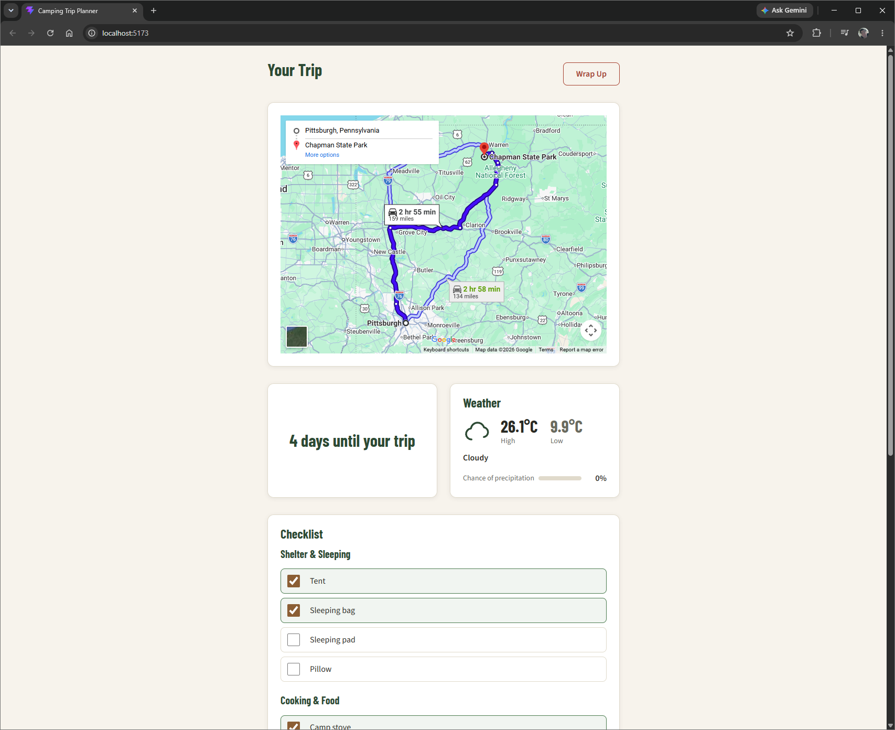

# camping-trip-planner

A camping trip planner that reveals itself progressively: start with a
minimal search bar, and once you set a trip, get a driving-route map, a
countdown, a live weather forecast, and a packing checklist — all backed
by a real database, one trip at a time.

Built as a course project exploring **Loop Engineering**: using an AI
coding agent (Claude Code) inside automated build-verify-repeat loops,
rather than manual one-off prompting, to implement and self-correct real
features.

## Features

- **Progressive UI:** a minimal From / Where / When search screen, then
  a full trip detail view once a trip exists.
- **Route map:** embedded Google Maps driving directions from your
  starting point to the destination.
- **Countdown:** days remaining until the trip starts.
- **Weather forecast:** live forecast for the destination on the trip's
  start date (via Open-Meteo, no API key required), with a graceful
  fallback for trips too far in the future to forecast.
- **Packing checklist:** a default checklist seeded per trip, grouped by
  category, with persisted check/uncheck state.
- **Wrap Up:** clears the active trip and its checklist when you're done.
- **Session-based auth:** one active trip per user at a time.

## Tech Stack

- **Frontend:** React + Vite
- **Backend:** Spring Boot (Java 21, Gradle)
- **Database:** MySQL, schema managed by Flyway
- **Infrastructure:** Docker Compose
- **External APIs:** Google Maps Embed API, Open-Meteo (forecast +
  geocoding)

## Getting Started

See **[running.md](./running.md)** for full setup instructions,
including environment variables and Google Maps API key setup. Short
version:

```bash
docker compose up --build      # backend + MySQL
cd frontend && npm install && npm run dev   # frontend dev server
```

## Test in Local

Once the backend and frontend are both running, open your browser to
[http://localhost:5173/](http://localhost:5173/). Register a new account,
log in, and you're ready to plan a trip.



## Repository Structure

```text
.
├── backend/            Spring Boot API (Java, Gradle)
├── frontend/            React + Vite single-page app
├── docs/                 Specify/Design/Build/Review docs per step
│   ├── step1-base-system/     Login, search, map, checklist, wrap up
│   ├── step2-extension/       Weather forecast feature
│   ├── stepX-manual-testing/  Manual verification evidence
│   └── ui-polish/             Style guide + visual polish tasks
├── prompts/              Curated prompts given to the coding agent,
│                          organized to mirror docs/
├── scripts/              Loop-engineering driver scripts
│   ├── build-loop.sh            Backend build-verify-repeat loop
│   ├── frontend-build-loop.sh   Frontend build-verify-repeat loop
│   └── single-shot.sh           One-off agent tasks (still logged)
├── prompts.txt            Full raw log of every prompt sent to the agent
├── running.md             How to run this project
└── reflection.md          A software-engineering lesson from this project
```

## How This Was Built

This project was built in two steps, each carried through a
specify → design → build → review cycle, documented under `docs/`:

1. **Step 1 — Base System:** login, trip search, route map, countdown,
   and packing checklist.
2. **Step 2 — Extension:** live weather forecast for the destination.

The **Build** stage for both steps used an automated loop
(`scripts/build-loop.sh` / `scripts/frontend-build-loop.sh`): the agent
implements, the script independently runs the real build/test suite, and
on failure the exact failure output is fed back into the next prompt —
repeating until it genuinely passes or a safety cap is hit. Every prompt
sent is logged to `prompts.txt`; every iteration's outcome is logged to
each step's `03-build.md` and a raw `build-loop-raw.jsonl`.

See `docs/step1-base-system/03-build.md` for the loop's full design
rationale, and `reflection.md` for what turned out to be the most
interesting lesson from the exercise.

## Key Commits per Stage

This repo has many commits — the Build stage in particular is spread
across several, since that's where the build-verify-repeat loop actually
runs and self-corrects. The commits below are the ones that map directly
to each required stage of each step:

| Step            | Stage   | Commit                                                                                                          |
| --------------- | ------- | --------------------------------------------------------------------------------------------------------------- |
| 1 — Base System | Specify | [`e3bed23`](https://github.com/baezecillo/camping-trip-planner/commit/e3bed231604d71b858e1463f8327b118b5d10e43) |
| 1 — Base System | Design  | [`c1b582b`](https://github.com/baezecillo/camping-trip-planner/commit/c1b582b4e70f469565b8c804bdfe94f7b8a5bd96) |
| 1 — Base System | Build   | [`f63891a`](https://github.com/baezecillo/camping-trip-planner/commit/f63891aa887f21b5dd386de6191868c298f107f8) |
| 1 — Base System | Review  | [`faeae77`](https://github.com/baezecillo/camping-trip-planner/commit/faeae77c23ad40249451be7e78e87d975c383013) |
| 2 — Extension   | Specify | [`90b50ad`](https://github.com/baezecillo/camping-trip-planner/commit/90b50ad0747d1990ed08ca53243c32d992595faa) |
| 2 — Extension   | Design  | [`cdf5dad`](https://github.com/baezecillo/camping-trip-planner/commit/cdf5dad54caa7f3bc450dfdfae4403c61323d2cf) |
| 2 — Extension   | Build   | [`c64ee98`](https://github.com/baezecillo/camping-trip-planner/commit/c64ee98ff3349ddad9bd75d5a67be7eaaeb25161) |
| 2 — Extension   | Review  | [`7304c28`](https://github.com/baezecillo/camping-trip-planner/commit/7304c2830bcad2a99d19e03818655602402eb7c1) |

Both Build-stage commits above are the final commit in a short sequence
(backend loop → frontend loop → a real bug found via manual testing and
fixed via a second loop run) — the intermediate commits in each sequence
are additional loop-engineering evidence, not noise. `reflection.md` was
added in [`092cdda`](https://github.com/baezecillo/camping-trip-planner/commit/092cdda42904e2e76c57887ca51ce7e9e64abfed).
